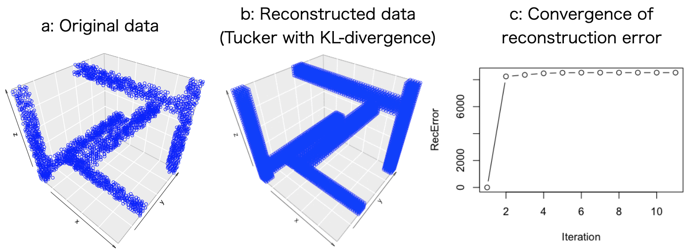

# Summary

Non-negative matrix factorization (NMF) is a widely used algorithm to decompose non-negative matrix data into factor matrices. Due to the interpretability of its non-negativity and the convenience of using decomposition results as clustering, there are many applications of NMF in image processing, audio processing, and bioinformatics [@nonnegative].

NMF has been applied to matrix data but there is a growing demand to apply NMF to more heterogeneous non-negative data such as multiple matrices and tensors (high-dimensional arrays), which are higher-order data structures than matrices [@nonnegative]. To meet these requirements, we originally developed \texttt{nnTensor}, which is an R/CRAN package to perform some non-negative matrix/tensor decomposition algorithms (\url{https://cran.r-project.org/web/packages/nnTensor/index.html}).

# Statement of need

In many cases, the latest tensor decomposition algorithms are implemented in MATLAB in the original papers, which means that those are not freely applicable to users' data immediately. To fill this gap, we originally implemented some non-negative matrix/tensor decomposition algorithms in R language, which is one of the popular open-source programming languages.

\texttt{nnTensor} provides the matrix/decomposition decomposition functions as follows:

- \texttt{NMF}: Non-negative matrix factorization for non-negative matrix [@nonnegative]
- \texttt{NMTF}: Non-negative matrix tri-factorization for non-negative matrix [@nmtf]
- \texttt{siNMF}: Simultaneous non-negative matrix factorization for non-negative matrix [@sinmf]
- \texttt{jNMF}: Joint non-negative matrices factorization for non-negative matrix [@jnmf]
- \texttt{NTF}: Non-negative tensor factorization for non-negative tensor [@nonnegative]
- \texttt{NTD}: Non-negative Tucker decomposition for non-negative tensor [@nonnegative]

All the objective functions are the divergence between the original matrix/tensor and the reconstructed matrix/tensor from the decomposition. Users can easily try some divergences including Frobenius norm, Kullback–Leibler (KL) divergence, and Itakura-Saito (IS) divergence by specifying \texttt{algorithm} argument. Some utility functions are available such as \texttt{recTensor} to reconstruct data matrix/tensor, \texttt{plotTensor2D}/\texttt{plotTensor3D} to visualize the structure of data matrix/tensor, and \texttt{toyModel} to provide some toy datasets so that users can immediately check the operation of these functions and learn how to use them. Besides, mask matrices/tensors can be specified in the matrix/tensor decomposition functions above to support rank estimation with cross-validation.

# Example

The non-negative tensor decomposition and plots in Figure \autoref{fig:tensor} can be easily reproduced on any machine where R is pre-installed by using the following commands in R:

```r
# Install package required (one per computer)
install.packages("nnTensor")

# Load required package (once per R instance)
library("nnTensor")

# Load Toy data
data <- toyModel("Tucker")

# Perform NTD
set.seed(1234)
out.ntd <- NTD(data, rank=c(4,5,6), algorithm="KL", num.iter=30)

# Reconstruction of data tensor
rec.data <- recTensor(S=out.ntd$S, A=out.ntd$A)

# Visualization
plotTensor3D(data)
plotTensor3D(rec.data)
plot(out.ntd$RecError, type="b", xlab="Iteration", ylab="RecError")
```

{ width=100% }

# Related work

There are some versatile tools to perform tensor decomposition such as \texttt{Tensorly} (Python, @tensorly), \texttt{TensorToolbox} (MATLAB, @tensortoolbox), and \texttt{TensorLab} (MATLAB, @tensorlab). In the R language, \texttt{rTensor} [@rtensor] is a widely used package to perform tensor decomposition but none of the non-negative type algorithms is implemented and \texttt{nnTensor} is the first package to meet the demand.

# References
