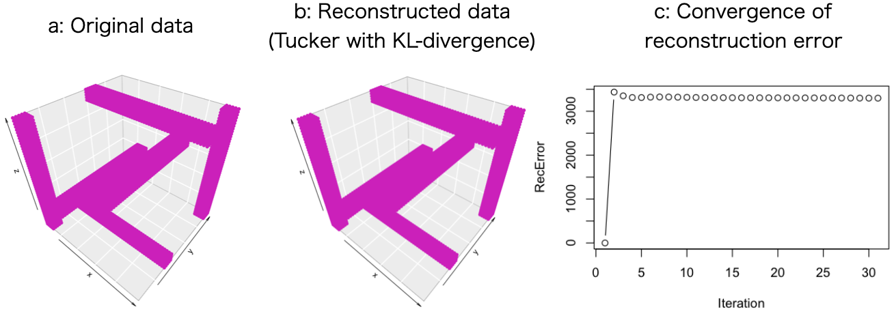

# Summary

We present \texttt{nnTensor}, an R/CRAN package for performing non-negative matrix and tensor decomposition, which we have originally implemented in R (\url{https://cran.r-project.org/web/packages/nnTensor/index.html}).

# Statement of need

As with dimension reduction algorithms applied to matrix data, such as principal component analysis, there has been a growing demand for tensor decomposition algorithms to perform against tensors (high-dimensional arrays), which are higher-order data structures than matrices.

However, in many cases, the latest tensor decomposition algorithms are implemented in MATLAB in the original papers, which means that those are not freely applicable to users' data immediately. To fill this gap, in this work, we originally implemented some tensor decomposition algorithms in R language, which is one of the popular open source programming languages.

\texttt{nnTensor} includes the decomposition functions as follows:

- NMF(): Non-negative matrix factorization for non-negative matrix [@nonnegative]
- NTF(): Non-negative matrix tri-factorization for non-negative matrix [@nmtf]
- siNMF(): Simultaneous non-negative matrix factorization for non-negative matrix [@sinmf]
- jNMF(): Joint non-negative matrices factorization for non-negative matrix [@jnmf]
- NTF(): Non-negative tensor factorization for non-negative tensor [@nonnegative]
- NTD(): Non-negative Tucker decomposition for non-negative tensor [@nonnegative]

All the objective functions are the divergence between the original matrix/tensor (Figure \autoref{fig:tensor}a) and the reconstructed matrix/tensor (Figure \autoref{fig:tensor}b).

User can specify some divergence including Frobenius norm, Kullback–Leibler (KL) divergence, and Itakura-Saito (IS) divergence. Toy data (Figure \autoref{fig:tensor}) is provided so that users can immediately check the operation of these functions and learn how to use them. Besides, mask matrices/tensors can be specified in the matrix/tensor decomposition funtions above to support rank estimation with cross-validation.

{ width=100% }

# Acknowledgements

This work was supported by JST, PRESTO Grant Number JPMJPR1945, special postdoctoral researcher (SPDR) program at RIKEN, and JSPS KAKENHI Grant Number 19K20406.

# References
